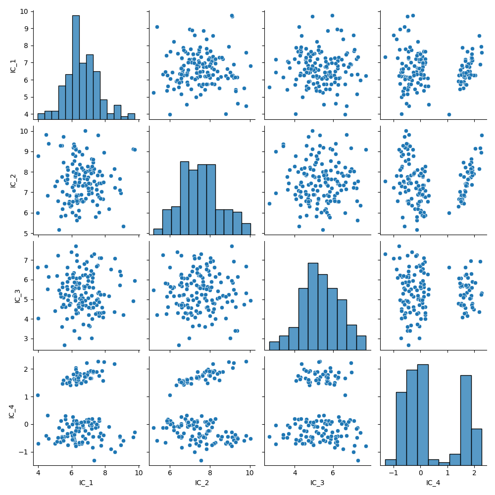
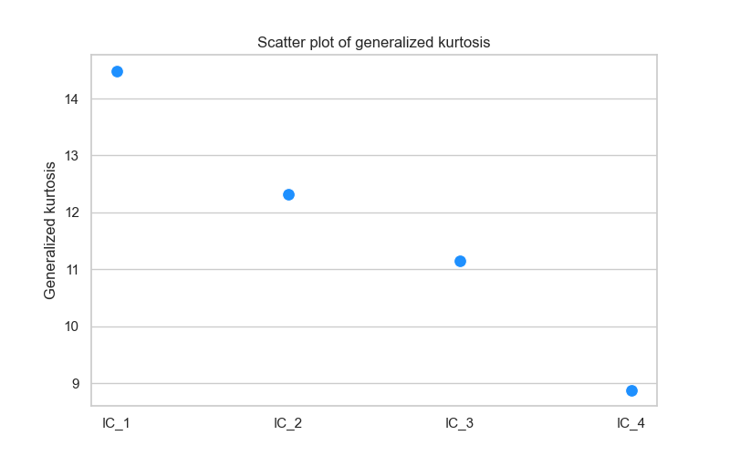

Usage
=====

This section provides examples of how to use the ICSpy package. The core of the package is the ICS class.
The implementation is similar to the sklearn framework, including a fit-transform logic. For more information about the
arguments and methods, check out the Module page. 

Example 1: Fitting the ICS model
--------------------------------
.. code-block:: python

    import pandas as pd
    from icspy import ICS, cov, covW
    from sklearn.datasets import load_iris

    # Load dataset
    iris = load_iris()
    X = pd.DataFrame(iris.data, columns=iris.feature_names)

    # Instantiate ICS object
    # ics = ICS() # default parameters
    ics = ICS(S1=cov, S2=covW, algorithm='standard', S2_args={'alpha': 1, 'cf': 2})

    # Fit and transform the ICS model (equivalent of the function ICS-S3() from the R package ICS)
    ics.fit_transform(X)

    # Printing a summary
    ics.describe()

**Example output:**

.. code-block:: text

    ICS based on two scatter matrices
    S1: cov
    S1_args: {}
    S2: covW
    S2_args: {'alpha': 1, 'cf': 2}

    Information on the algorithm:
    algorithm: standard
    center: False
    fix_signs: scores

    The generalized kurtosis measures of the components are:
    IC_1: 14.4888
    IC_2: 12.3233
    IC_3: 11.1507
    IC_4: 8.8856

    The coefficient matrix of the linear transformation is:
         sepal length (cm) sepal width (cm) petal length (cm) petal width (cm)
    IC_1       -0.52335      1.99326      2.37305     -4.43078
    IC_2        0.83296      1.32750     -1.26665      2.78998
    IC_3        3.05683     -2.22695     -1.63543      0.36544
    IC_4        0.05244      0.60315     -0.34826     -0.37984

Example 2: Plotting transformed data
------------------------------------
.. code-block:: python

    # Plot transformed data (scores)
    ics.plot()

**Example plot:**

.. code-block:: python

    # Plot kurtosis (eigenvalues)
    ics.plot_kurtosis()

**Example plot:**

Example 3: Fitting and transforming separately
----------------------------------------------
.. code-block:: python

    from sklearn.datasets import load_iris
    from sklearn.model_selection import train_test_split
    from sklearn.linear_model import LogisticRegression

    # Load the Iris dataset
    iris = load_iris()
    X = iris.data
    y = iris.target

    # Split the data into training and test sets
    X_train, X_test, y_train, y_test = train_test_split(X, y, test_size=0.2, random_state=42)

    # Create a logistic regression model with ICS as a preprocessing step
    ics = ICS()
    model = LogisticRegression(max_iter=200)

    # Train the model on the training set
    ics.fit(X_train)
    X_train_ics = ics.transform(X_train)
    model.fit(X_train_ics, y_train)

    # Make predictions on the test set
    X_test_ics = ics.transform(X_test)
    y_pred = model.predict(X_test_ics)
